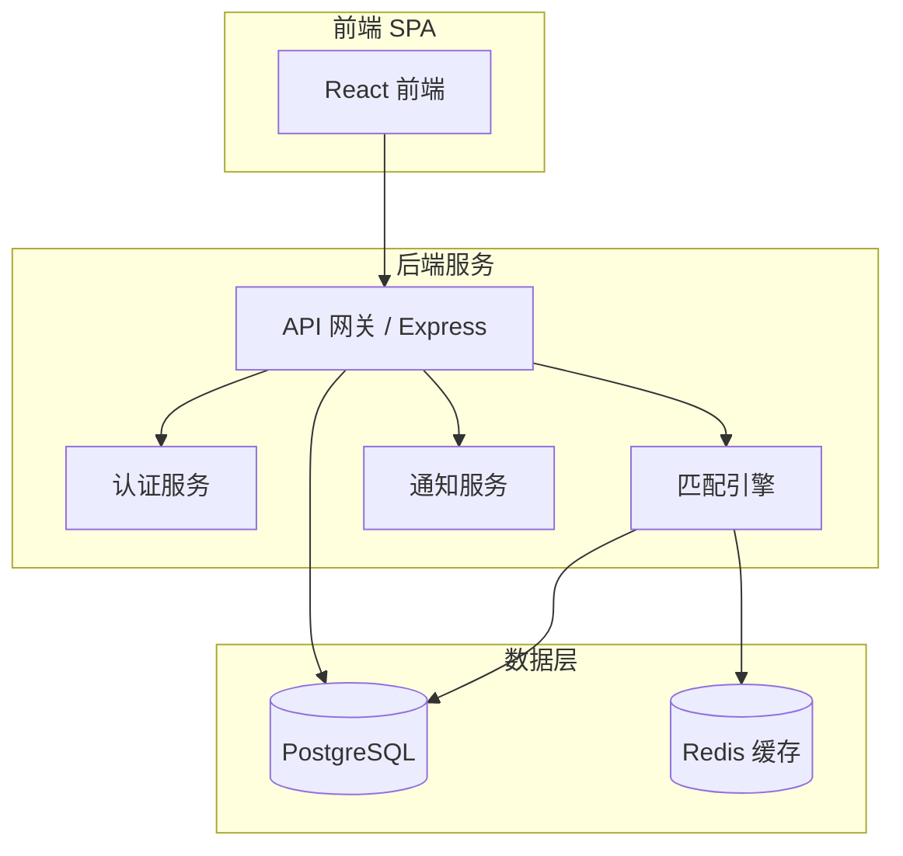

# 设计文档：社团招新智能匹配平台

## 概述

本平台采用前后端分离架构，后端提供 RESTful API，前端为单页应用（SPA）。核心模块包括：用户与权限管理、社团信息管理、智能匹配引擎、报名申请流程和数据统计看板。

匹配算法基于 Jaccard 相似度计算学生兴趣标签与社团标签的重叠程度，将结果映射到 0–100 分区间，作为推荐排序依据。

---

## 架构



**技术选型：**
- 前端：React + TypeScript
- 后端：Node.js + Express + TypeScript
- 数据库：PostgreSQL（持久化）+ Redis（推荐列表缓存）
- 认证：JWT（JSON Web Token）

---

## 组件与接口

### 1. 认证模块（AuthService）

负责学生和社团管理员的注册、登录与权限校验。

```typescript
interface AuthService {
  register(email: string, password: string, role: 'student' | 'club_admin'): Promise<User>
  login(email: string, password: string): Promise<{ token: string; user: User }>
  verifyToken(token: string): Promise<User>
}
```

### 2. 学生画像模块（StudentProfileService）

管理学生兴趣标签的创建与更新。

```typescript
interface StudentProfileService {
  createProfile(studentId: string, tags: string[]): Promise<StudentProfile>
  updateTags(studentId: string, tags: string[]): Promise<StudentProfile>
  getProfile(studentId: string): Promise<StudentProfile>
}
```

### 3. 社团管理模块（ClubService）

处理社团的 CRUD 操作。

```typescript
interface ClubService {
  createClub(adminId: string, data: ClubCreateInput): Promise<Club>
  updateClub(clubId: string, data: Partial<ClubCreateInput>): Promise<Club>
  getClub(clubId: string): Promise<Club>
  listClubs(filter: ClubFilter): Promise<PaginatedResult<Club>>
  searchClubs(keyword: string, type?: string): Promise<Club[]>
}
```

### 4. 匹配引擎（MatchingEngine）

计算学生与社团的匹配分数，生成推荐列表。

```typescript
interface MatchingEngine {
  computeScore(studentTags: string[], clubTags: string[]): number
  generateRecommendations(studentId: string): Promise<RecommendationList>
  invalidateCache(studentId: string): Promise<void>
}
```

**匹配算法：**

使用 Jaccard 相似度：

```
score = |studentTags ∩ clubTags| / |studentTags ∪ clubTags| × 100
```

- 分数范围：0–100（整数）
- 若交集为空（分数为 0），退化为按社团热度（申请总数）排序

### 5. 申请管理模块（ApplicationService）

处理学生报名申请的完整生命周期。

```typescript
interface ApplicationService {
  submitApplication(studentId: string, clubId: string, formData: Record<string, string>): Promise<Application>
  withdrawApplication(applicationId: string, studentId: string): Promise<void>
  reviewApplication(applicationId: string, adminId: string, status: ReviewStatus): Promise<Application>
  getApplicationsByClub(clubId: string): Promise<Application[]>
  getApplicationsByStudent(studentId: string): Promise<Application[]>
}

type ReviewStatus = 'approved' | 'rejected' | 'pending'
```

### 6. 通知服务（NotificationService）

发送站内通知。

```typescript
interface NotificationService {
  sendNotification(userId: string, message: string, type: NotificationType): Promise<void>
  getNotifications(userId: string): Promise<Notification[]>
  markAsRead(notificationId: string): Promise<void>
}
```

### 7. 统计模块（StatisticsService）

提供社团招新数据统计。

```typescript
interface StatisticsService {
  getClubStats(clubId: string): Promise<ClubStats>
  getDailyApplicationTrend(clubId: string, days: number): Promise<DailyTrend[]>
  getApplicantTagDistribution(clubId: string): Promise<TagDistribution[]>
}
```

---

## 数据模型

### User（用户）

```typescript
interface User {
  id: string           // UUID
  email: string        // 唯一
  passwordHash: string
  role: 'student' | 'club_admin'
  createdAt: Date
}
```

### StudentProfile（学生画像）

```typescript
interface StudentProfile {
  id: string
  studentId: string    // 关联 User.id
  tags: string[]       // 兴趣标签列表，至少 1 个
  updatedAt: Date
}
```

### Club（社团）

```typescript
interface Club {
  id: string
  adminId: string      // 关联 User.id
  name: string         // 2–50 字符，唯一
  description: string
  type: ClubType       // 文艺 | 体育 | 学术 | 公益 | 科技
  tags: string[]       // 社团特征标签
  capacity: number     // 招新名额
  currentCount: number // 已通过申请数
  photos: string[]     // 图片 URL，最多 5 张
  isOpen: boolean      // 是否开放报名
  createdAt: Date
  updatedAt: Date
}

type ClubType = 'arts' | 'sports' | 'academic' | 'charity' | 'tech'
```

### Application（申请）

```typescript
interface Application {
  id: string
  studentId: string    // 关联 User.id
  clubId: string       // 关联 Club.id
  formData: Record<string, string>
  status: 'pending' | 'approved' | 'rejected' | 'withdrawn'
  createdAt: Date
  updatedAt: Date
}
```

### Notification（通知）

```typescript
interface Notification {
  id: string
  userId: string
  message: string
  type: 'application_status' | 'system'
  isRead: boolean
  createdAt: Date
}
```

### RecommendationList（推荐列表）

```typescript
interface RecommendationItem {
  club: Club
  score: number        // 0–100
}

interface RecommendationList {
  studentId: string
  items: RecommendationItem[]  // 按 score 降序
  generatedAt: Date
}
```

---

## 正确性属性

*属性（Property）是在系统所有合法执行中都应成立的特征或行为——本质上是对系统应做什么的形式化陈述。属性是人类可读规范与机器可验证正确性保证之间的桥梁。*

### 属性 1：匹配分数范围不变式

*对于任意* 学生兴趣标签集合和社团标签集合，匹配引擎计算出的分数必须在 [0, 100] 区间内（含端点）。

**验证：需求 3.2**

---

### 属性 2：推荐列表排序单调性

*对于任意* 推荐列表，列表中相邻两项的匹配分数满足前者大于或等于后者（非递增顺序）。

**验证：需求 3.3**

---

### 属性 3：标签更新后推荐列表一致性（轮回属性）

*对于任意* 学生，将其兴趣标签更新为标签集合 T，然后立即获取推荐列表，推荐列表的计算所使用的标签集合应等于 T。

**验证：需求 3.4**

---

### 属性 4：申请唯一性不变式

*对于任意* 学生和社团的组合，在系统中处于非「已撤回」状态的申请记录最多只能有 1 条。

**验证：需求 4.3**

---

### 属性 5：名额满员时报名关闭

*对于任意* 社团，当已通过申请数（currentCount）等于招新名额（capacity）时，系统应拒绝新的申请提交。

**验证：需求 2.5**

---

### 属性 6：申请状态流转合法性

*对于任意* 申请，其状态只能按以下合法路径流转：
- `pending` → `approved`
- `pending` → `rejected`
- `pending` → `withdrawn`

不存在从终态（`approved`、`rejected`、`withdrawn`）到其他状态的流转。

**验证：需求 4.4, 4.6**

---

### 属性 7：搜索结果相关性

*对于任意* 非空关键词，搜索返回的每条社团记录，其名称或简介中必须包含该关键词（大小写不敏感）。

**验证：需求 5.1**

---

### 属性 8：统计数据一致性

*对于任意* 社团，其统计数据中「申请总数」应等于「通过数 + 拒绝数 + 待审核数 + 已撤回数」之和。

**验证：需求 6.1**

---

## 错误处理

| 错误场景 | HTTP 状态码 | 错误码 | 说明 |
|---|---|---|---|
| 社团名称重复 | 409 | CLUB_NAME_DUPLICATE | 需求 2.3 |
| 重复申请 | 409 | APPLICATION_DUPLICATE | 需求 4.3 |
| 兴趣标签为空 | 400 | TAGS_REQUIRED | 需求 1.3 |
| 名额已满 | 422 | CLUB_CAPACITY_FULL | 需求 2.5 |
| 申请状态非法流转 | 422 | INVALID_STATUS_TRANSITION | 需求 4.4 |
| 未授权操作 | 403 | FORBIDDEN | 通用 |
| 资源不存在 | 404 | NOT_FOUND | 通用 |

所有错误响应统一格式：

```json
{
  "error": {
    "code": "ERROR_CODE",
    "message": "人类可读的错误描述"
  }
}
```

---

## 测试策略

### 双轨测试方法

本项目采用**单元测试**与**基于属性的测试（Property-Based Testing）**相结合的方式：

- **单元测试**：验证具体示例、边界条件和错误场景
- **属性测试**：验证对所有合法输入均成立的普遍性质

两者互补，共同保障系统正确性。

### 属性测试配置

- 使用 **fast-check**（TypeScript 生态主流 PBT 库）
- 每个属性测试最少运行 **100 次迭代**
- 每个属性测试必须通过注释标注对应的设计属性编号

标注格式：`// Feature: club-recruitment-matching, Property {N}: {属性描述}`

### 属性测试任务

| 属性编号 | 测试描述 | 对应需求 |
|---|---|---|
| 属性 1 | 匹配分数始终在 [0, 100] 内 | 3.2 |
| 属性 2 | 推荐列表按分数非递增排序 | 3.3 |
| 属性 3 | 标签更新后推荐列表使用新标签 | 3.4 |
| 属性 4 | 同一学生对同一社团无重复有效申请 | 4.3 |
| 属性 5 | 名额满时拒绝新申请 | 2.5 |
| 属性 6 | 申请状态流转路径合法 | 4.4, 4.6 |
| 属性 7 | 搜索结果包含关键词 | 5.1 |
| 属性 8 | 统计数据各项之和等于总数 | 6.1 |

### 单元测试重点

- 匹配分数计算的边界值（空标签集、完全重叠、无重叠）
- 申请状态机的非法流转拒绝
- 社团名称重复检测
- 分页逻辑的边界条件
